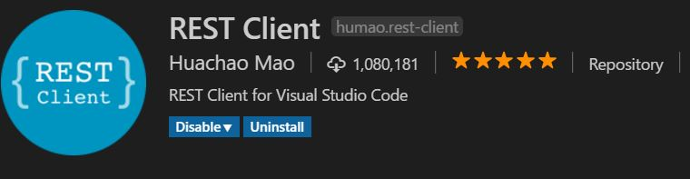

## **Coder Academy - 21/05/2018**

### **Learning Outcome**

1. List of Libraries and Framework we will be learning:
    
    **JavaScript Libraries**
    - lodash https://lodash.com/docs/
    - underscore http://underscorejs.org/
    - moment https://momentjs.com/docs/
    - math http://mathjs.org/docs/
    - immutable https://facebook.github.io/immutable-js/docs/
    - babel https://babeljs.io/
    - three https://threejs.org/docs/
    - p5 https://p5js.org/
    - jQuery https://api.jquery.com/
    - D3 https://d3js.org/
    - socket https://socket.io/
    - chart http://www.chartjs.org/

    **Frameworks**
    - Backbone
    - Angular
    - Ember
    - React
    - Vuejs

    **CDN**
    - unpkg https://unpkg.com/
    - cloudflare https://www.cloudflare.com/cdn/

2. **REST Client** extension in VS Code - install and check docs (it basically allows you to test if your REST request is working)

    

3. **Postman** - similar to REST Client extension in VS Code, but it has more features and is normally used in project (See [link](https://www.getpostman.com/))

4. **Form Building Exercise** - See current Github repo "backend" and "frontend"
    - See setup instruction in "backend" folder for setup of rails application
    - See "frontend" `index.html` for form setup
    - For form styling, we tried using [Material CSS](https://materializecss.com/getting-started.html) as our CSS framework. The easiest way to get this going is applying the stylesheet CDN in HTML.
    - See "frontend" `index.js` for form POST-ing into the backend and retrieving data from the backend to be displayed
    - Learnt using `.classList.add()` instead of just `.className = xxx`
    - Learnt using [data-attributes](https://developer.mozilla.org/en-US/docs/Learn/HTML/Howto/Use_data_attributes)
    - *Note*: In order for the "frontend" to access the rails app (backend), will need to use a gem called [rack-cors](https://github.com/cyu/rack-cors). Follow the instruction to set up the `config/application.rb`.

5. JavaScript Destructuring - See [article](http://exploringjs.com/es6/ch_destructuring.html) for more info.
    - Illustration can be found in "frontend" `destructure.js`

6. Briefly walked through **Graph Theory** - see some articles posted by Cameo which will be more helpful
    - https://medium.com/basecs/a-gentle-introduction-to-graph-theory-77969829ead8
    - https://medium.freecodecamp.org/i-dont-understand-graph-theory-1c96572a1401